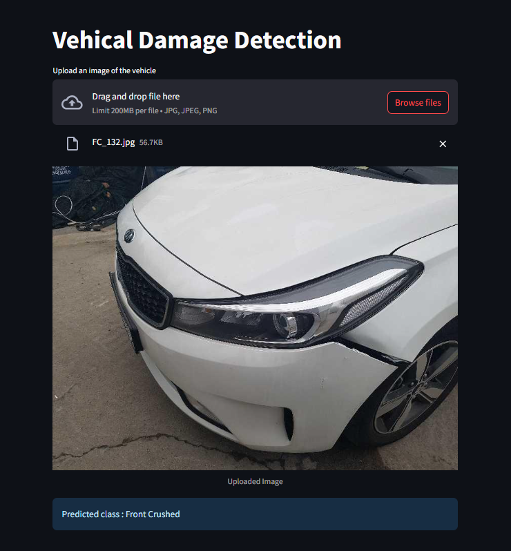

# Vehicle Damage Detection App

This app lets you drag and drop an image of a car and it will tell you 
what kind of damage it has. The model is trained on third quarter front and rear view hence the picture should capture the third quarter front or rear view of the car.
---

## 📸 Application Preview



---

### Model Details
1. Used ResNet50 for transfer learning
2. Model was trained on around 2300 images with 6 target classes
- Front Breakage  
- Front Crushed  
- Front Normal  
- Rear Breakage  
- Rear Crushed  
- Rear Normal  

### Set up

1.To get started, First install the dependencies using:
  ```CommandLine
   pip install -r requirements.txt
```
2. Run the Streamlit app using:
  ```CommandLine
   streamlit run app.py
``` 
